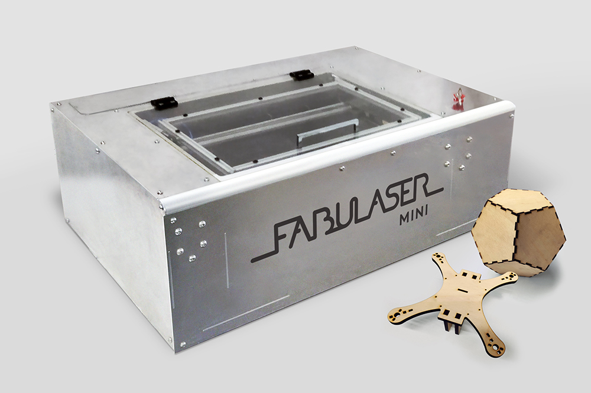
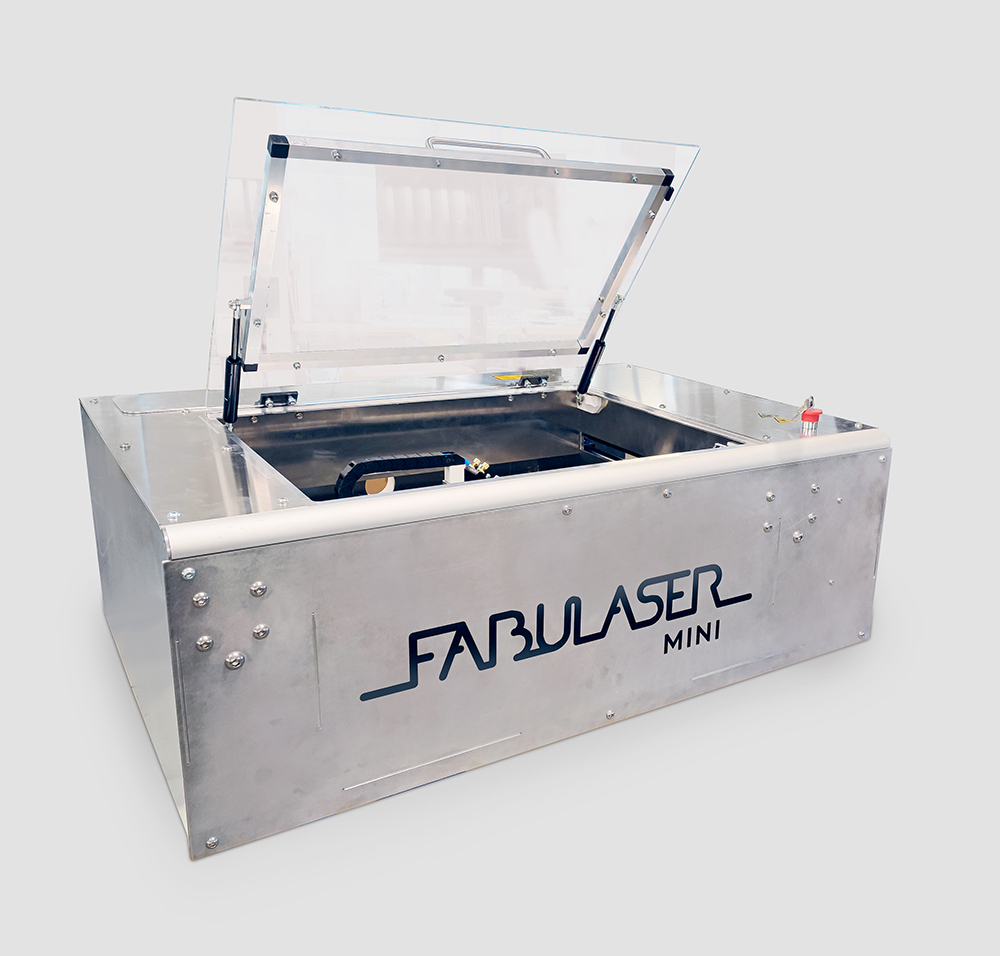
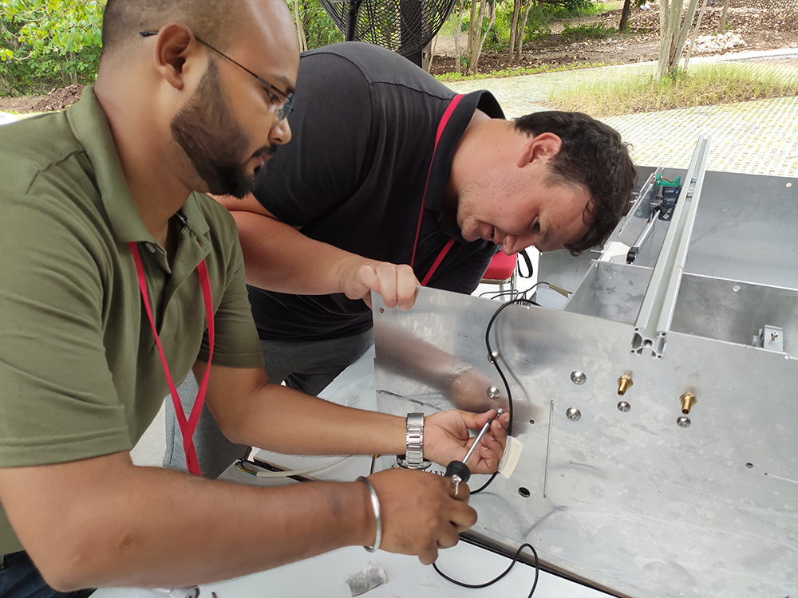
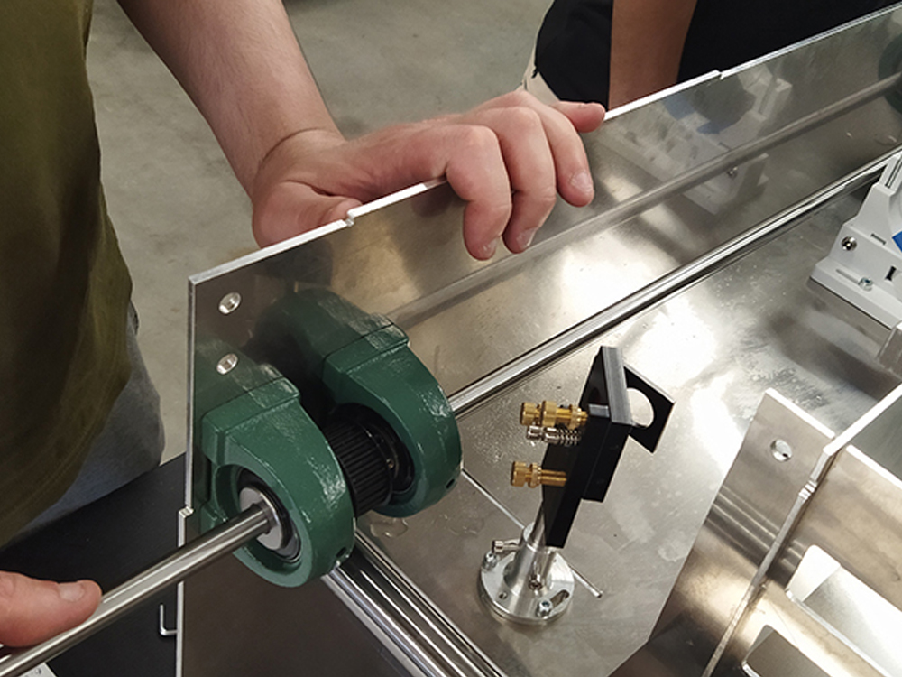
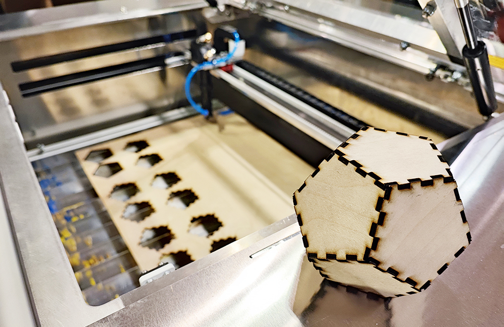
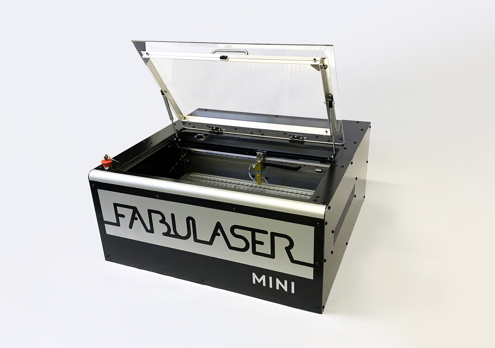

<h1 style=align="center">Fabulaser Mini V3</h1>

<i>An open source laser cutter within your reach.</i>

 

Introduction 
---
Fabulaser Mini is a compact, yet  powerful, open source laser cutter. Developed to fit in Fab Labs and classrooms, Fabulaser Mini aims to lower the boundaries of accessing laser cutting technology, representong an ideal compromise between performance and cost. With an optimized 40W CO2 laser, it is able to cut 8mm acrylic, and with a cutting area of 600x400mm is one the largest of this machine category. The compact machine size of 1161x812x390mm, allows the usage in small rooms with a normal table or a desk.

 

A tool to make, a tool to learn.
--

 

In comparison to commercial laser cutters, Fabulaser Mini adds on top of the laser cutting functionalities a valuable learning experience. Ideally built together with students during a workshop, Fabulaser Mini will give to the user not only the possibility to laser cut, but also to learn how the machine is made, how it works. And other than learning about electronics, mechanics and lasers, the final user will also have a deep knowledge of the machine, so to be able to efficiently execute maintenance, apply improvements and even design his own machine later on!

The Kit
--

Fabulaser Mini kit, is the one-stop solution for everything you need to fully use the laser cutting capabilities of Fabulaser Mini. Providing all the required parts and special tools to build the laser cutter, Fabulaser Mini kit also provides all the additional accessories to start laser cutting out of the box. As well as all the required adapters and connections are provided, so that the user only have to concentrate on assembly, without losing time in searching and buying additional parts.

Included in the Fabulaser Kit:

- Fabulaser Mini machine parts
- air assist compressor
- exhaust radial fan
- indoor air filter
- water chiller
- all the required connections/adapters

More info on Fabulaser Mini are available at: [http://fabulaser.net/](http://fabulaser.net/)

Fabulaser Mini V3 specifications
--

 
- laser source: 40W CO2
- cutting area: 600x400mm
- resolution: 0.05mm 
- max. cutting thickness: 
  - 8mm acrylic
  - 6mm MDF
  - 8mm Plywood
- max speed: 400mm/s
- motion: linear rails
- frame and housing: interlocked aluminum plates
- bed: aluminum lamella
- controller: 32bit LPC1768
- firmware: [grbl-LPC](https://github.com/cprezzi/grbl-LPC)
- machine dimensions: 1161x812x390mm

Files
--

- **[BOM](Fabulaser_Mini_V3_BOM.pdf)**
- **[Firmware](firmware)**
- **[CAD](cad)**
- **[Settings](settings)**
- **[Workbook](Fabulaser_Mini_V3_Workbook.pdf)**
- **[Wiring Schematic](WiringSchematic_FabulaserMini_V3.pdf)**

Authors
--

Fabulaser Mini has been designed, developed and manufactured by: 

- **Daniele Ingrassia, daniele@inmachines.net**
- **[InMachines Ingrassia GmbH](https://www.inmachines.net/)** 

License
--

The Fabulaser Mini hardware design, CAD and PCB files, BOM, settings and relative files are are released under the following open source license:

- CERN Open Hardware Licence Version 2 Weakly Reciprocal - **[CERN-OHL-W](LICENSE_CERN_OHL_W_V2.txt)**

The Fabulaser assembly manual, pictures and presentation text of this repository are released under the following license:

- Creative-Commons-Attribution-ShareAlike 4.0 International - **[CC BY-SA 4.0](LICENSE_CC_BY_SA_4.0.txt)**

Fabulaser Mini uses grbl-LPC [https://github.com/cprezzi/grbl-LPC](https://github.com/cprezzi/grbl-LPC), released under the [GPLv3 license](https://www.gnu.org/licenses/gpl-3.0.en.html).

Previous version
--

Previous versions of Fabulaser Mini will always be available. 

**[Fabulaser Mini V2 Repository](Fabulaser_Mini_V2)** 

