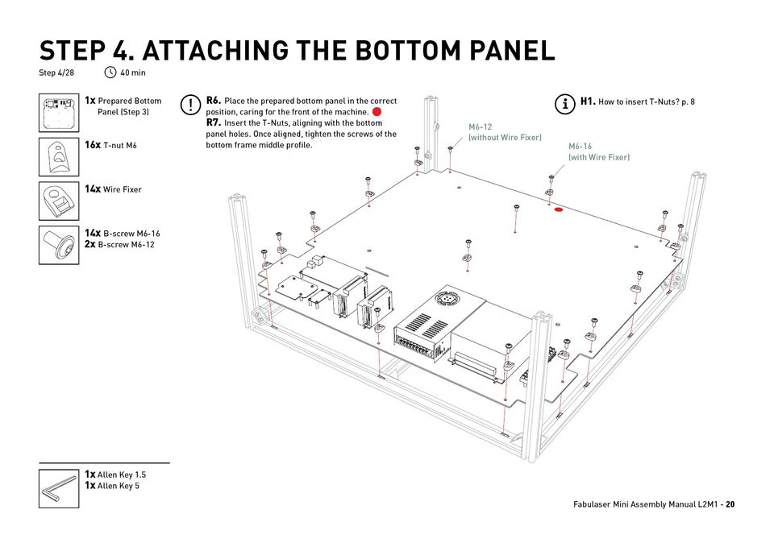
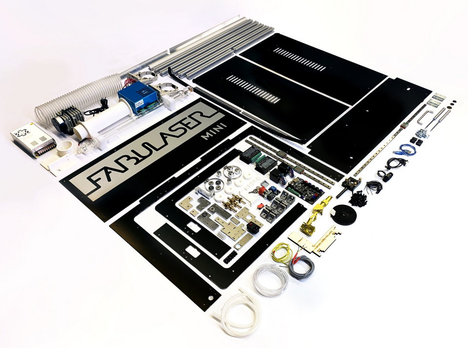
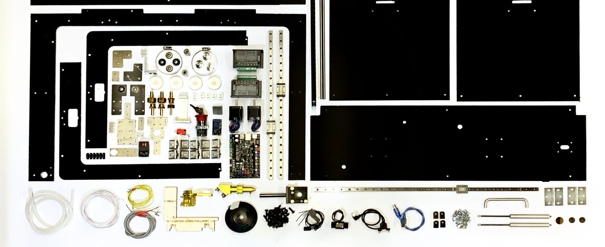
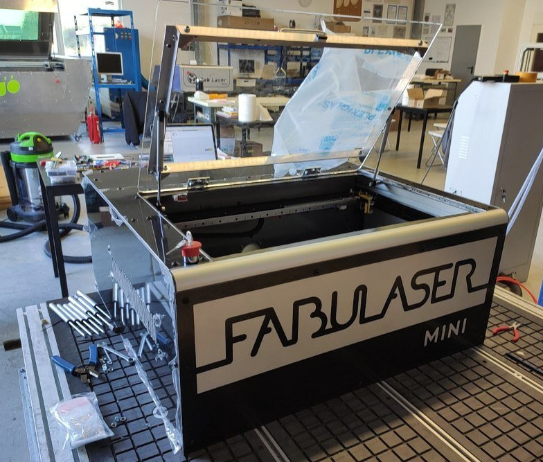

<h1 style=align="center">Fabulaser Mini</h1>

<i>Une découpeuse laser pour tous.</i>

Introduction
---
Fabulaser est une découpeuse laser compact mais puissante et 100% open source. Développé pour les Fab Labs et des salles de classe, Fabulaser Mini vise à abaisser les limites de l'accès à cette technologie, représentant un compromis idéal entre performances et coût. Avec un laser CO2 optimisé de 40 W, il est capable de couper de l'acrylique de 8 mm et avec une zone de coupe de 600 x 400 mm, un des plus grands de cette catégorie de machines! La taille compacte de la machine de 870x810x380mm et son poids inférieur à 60kg, permettent l'utilisation dans de petites pièces avec juste une table ou un bureau.

Fait pour fabriquer, et pour apprendre.
--
Fabulaser Mini ajoute aux fonctionnalités de découpe laser une expérience d'apprentissage précieuse. Idéalement construit avec des étudiants ou enseignants lors d'un atelier, Fabulaser Mini donnera à l'utilisateur non seulement la possibilité de découper au laser, mais aussi d'apprendre comment la machine est fabriquée et comment elle fonctionne. Et outre l'apprentissage de l'électronique, de la mécanique et des lasers, l'utilisateur final aura également une connaissance approfondie de la machine, afin de pouvoir exécuter efficacement la maintenance, appliquer des améliorations et même concevoir sa propre machine plus tard!

Les instructions d'assemblage (traduction en Français en cours)
--

Fabulaser Mini est livré avec des instructions d'assemblage détaillant tous les détails d'assemblage. Divisé en étapes, le manuel explique également les pratiques générales de construction, l'étalonnage du laser et la manière de connecter tous les composants électroniques de la machine. Les enseignants peuvent également utiliser le manuel pour diviser les participants à l'atelier en groupes.

Le Kit
--

Le kit Fabulaser Mini est la solution unique avec tous les éléments pour la fabrication de la machine.  Avec toutes les pièces nécessaires et les outils spéciaux pour l'assemblage, vous pouvez directement démarrer la gravure et les découpes une fois terminé. De plus, tous les adaptateurs et connexions nécessaires sont fournis, de sorte que l'utilisateur ne perd pas de temps à rechercher et à acheter des pièces supplémentaires.

Dans le Kit Fabulaser on trouve:

- Toutes les composants mécanique
- compresseur
- ventilateur
- système de filtration d'air
- système de refroidissement d'eaux
- Toutes les adaptateurs/ connecteurs nécessaires

Pour plus d'information ou pour l'achat d'un kit en France: [https://digitalgravity.fr/fr/fabulaser/](https://digitalgravity.fr/fr/fabulaser/)

Si vous voulez acheter la machine en dehors de la France, c'est ici: [http://fabulaser.net/](http://fabulaser.net/)

Fabulaser Mini specifications
--
- Source Laser: 40W CO2
- Zone de coupe: 600x400mm
- Resolution: 0.05mm
- Épaisseur de coupe max:
  - 8mm acrylique
  - 6mm MDF
  - 8mm Contreplaqué
- Vitesse de découpe max: 400 mm/s
- Système de mouvement: linear rails
- Construction: aluminum composite
- Lit de découpe: aluminum lamella
- Cadre: aluminum profiles
- Contrôleur: 32bit LPC1768
- Firmware: [grbl-LPC](https://github.com/cprezzi/grbl-LPC)
- Dimensions: 870x810x380mm

Fichiers
--
- **[Manuel de montage](manual)**
- **[BOM](Fabulaser_V2.1_BOM.pdf)**
- **[Firmware](firmware)**
- **[DAO](cad)**
- **[Converter PCB](converterPCB)**
- **[Réglages](settings)**

Authors
--

Les auteurs du manuel d'assemblage du Fabulaser Mini sont : 
- **Marc Kohlen, marckohlen@3dinx.com**
- **Liane Sayuri Honda, licasayurih@gmail.com**

Fabulaser Mini a été conçu, développé et fabriqué par : 

- **Daniele Ingrassia, daniele@inmachines.net**
- **[InMachines Ingrassia GmbH](https://www.inmachines.net/)** 

License
--

Le hardware du Fabulaser Mini, les fichiers CAO et les PCBs, la BOM, les paramètres et toutes les fichiers connecté sont publiés sous la licence open source suivante :

- CERN Open Hardware Licence Version 2 Weakly Reciprocal - **[CERN-OHL-W](LICENSE_CERN_OHL_W_V2.txt)**

Le manuel d'assemblage, les images et les textes de ce référentiel sont publiés sous la licence suivante :

- Creative-Commons-Attribution-ShareAlike 4.0 International - **[CC BY-SA 4.0](LICENSE_CC_BY_SA_4.0.txt)**

Fabulaser Mini utilises grbl-LPC [https://github.com/cprezzi/grbl-LPC](https://github.com/cprezzi/grbl-LPC), publiés sous [GPLv3 license](https://www.gnu.org/licenses/gpl-3.0.en.html).
